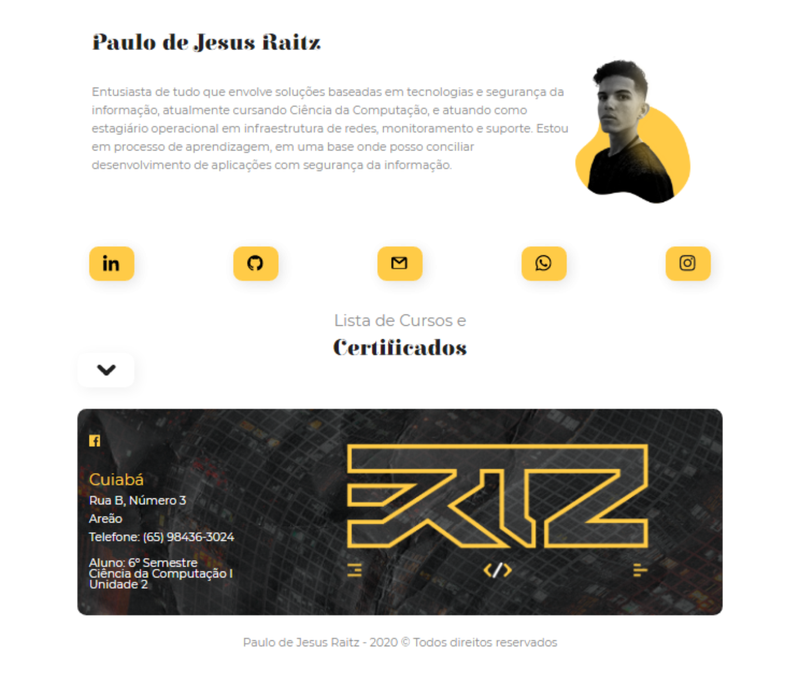

<h1 align="center">
    
</h1>

<p align="center">
  <a href="#-projeto">Projeto</a>&nbsp;&nbsp;&nbsp;|&nbsp;&nbsp;&nbsp;
  <a href="#-uso">Uso</a>&nbsp;&nbsp;&nbsp;|&nbsp;&nbsp;&nbsp;
  <a href="#memo-licença">Licença</a>
</p>

<p align="center">
 

  
</p>

## 💻 Projeto

courses.github.io é um projeto de resolução de desafio proposto pelo meu professor de desenvolvimento web para iniciantes - Universidade de Cuiabá.

## 🌐 [Visualizar site](https://paulo-jraitz.github.io/courses.github.io/)

<p align="center">
  
</p>

## 🌐 Uso

```
Não é necessário ter superpoderes de programação para executar esse projeto, basta baixar o repositório e executar o arquivo index.html.
```

## :memo: Licença

Esse projeto está sob a licença MIT. Veja o arquivo [LICENSE](LICENSE.md) para mais detalhes.
